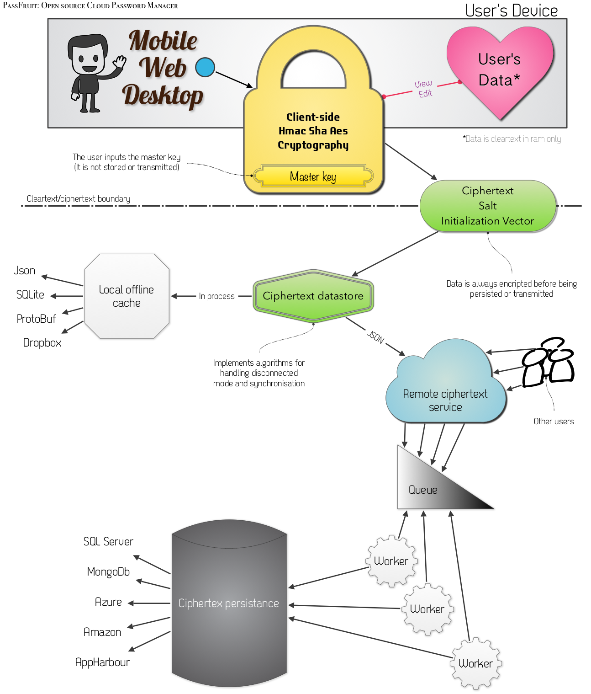

PassFruit
=========

*Open source secure cloud password manager.*

Security
--------

PassFruit lets you manage your password in a secure way by ensuring they are never displayed in clear when not needed.

Your passwords are encrypted with your master key in the client and sent encrypted through the wire to the cloud where they remain encrypted. When a password is requested, it is sent encrypted to the client.

Your masterkey is never persisted and never sent to the server.

Only one password at a time is in memory in cleartext and they are decrypted always in the client.

If using a cloud password storage service you can enable double security that consist in requesting an access token with limited duration which is sent by email to the registered addess and enables a one-time password storage access. No one will be able to access your passwords without access to your email addess.

All the code is opensource, you can check by yourself the implementation.

Password storage services
-------------------------

You can have your encrypted password persisted using the following services:

- [Local encrypted XML file (Single device mode)](https://trello.com/c/ZwoEyIgn)
- [Dropbox](https://trello.com/c/RPC56yxs)
- [Windows SkyDrive](https://trello.com/c/Rqxb2V5t)
- [CloudApp](https://trello.com/c/QiaOKOCn)
- [Windows Azure (REST Service)](https://trello.com/c/ImI6ZkrI)
- [AppHarbor (REST Service)](https://trello.com/c/JwbYlKC4)
- [Heroku (REST Service)](https://trello.com/c/d0U08lII)

You need your own account to persist the data in the cloud.

Client password access
----------------------

This is the selection of available clients

- [Windows (WPF)](https://trello.com/c/1lZZ3HGM)
- [Web (HTML + JS + encrypted JSON)](https://trello.com/c/bzMgVngO)
- [Windows Phone (Silverlight)](https://trello.com/c/0a5Qc5Oi)
- [Android](https://trello.com/c/M26yUbVf)
- [Mac OS X (Cocoa)](https://trello.com/c/7chNcCXr)
- [iOS (Cocoa Touch)](https://trello.com/c/iLvncg3Z)

Discussion
----------

[Trello PassFruit Board](https://trello.com/board/passfruit/4f1f1713ffa52a1e57084422) 
Add ideas, or claim an idea and start working on it!

[JabbR PassFruit Chatroom](http://jabbr.net/#/rooms/PassFruit)
Discuss things in real-time.

[Ohloh Project Statistics](https://www.ohloh.net/p/passfruit)
View statistics about the project

Wiki
----
[More about PassFruit in the Wiki](https://github.com/bettiolo/PassFruit/wiki)

Author
------

[Marco Bettiolo](http://bettiolo.it) ([@bettiolo](https://twitter.com/bettiolo))

Credits
-------

I'd appreciate it to mention the use of this code somewhere if you use it in an app. On a website, in an about page, in the app itself, whatever. Or let me know by email or through github. It's nice to know where one's code is used.

License
-------

PassFruit | Copyright (C) 2013, Marco Bettiolo
* * *
PassFruit by Marco Bettiolo is licensed under a 
[Creative Commons Attribution-NonCommercial-ShareAlike 3.0 Unported License](http://creativecommons.org/licenses/by-nc-sa/3.0/).

High-level diagram
-------

